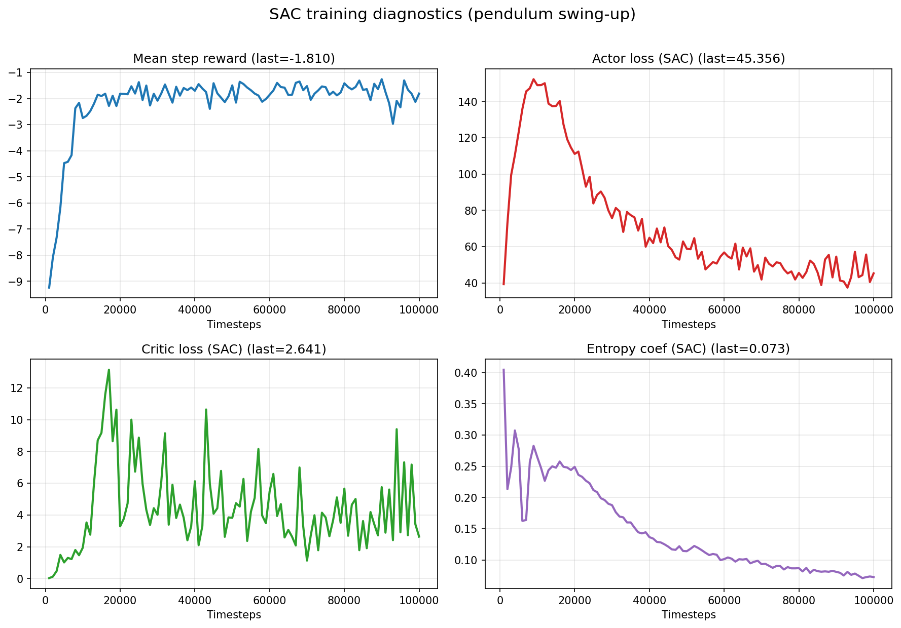
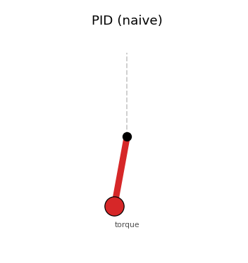
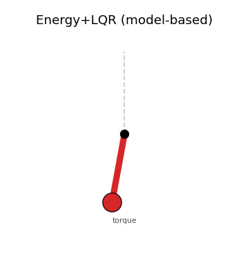
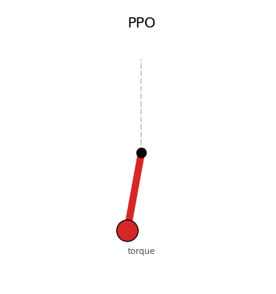
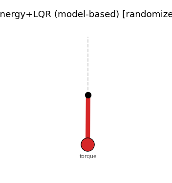
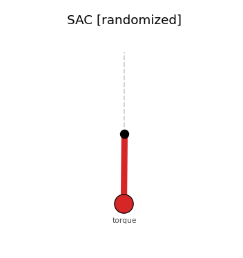
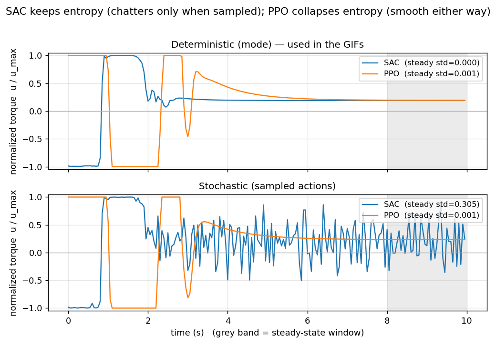

# 5 页面试 Deck —— 倒立摆 Swing-up：不确定性下的「经典控制 vs 强化学习」

> 一句话主旨：**模型准时，model-based 控制最优；模型不准时，带域随机化的 RL 才能换来鲁棒性 —— 而在连续控制上，off-policy 的 SAC 比 PPO 样本效率高得多。**

所有图表在 `results/pendulum/`，复现命令：`python scripts/pendulum_study.py`。

---

## Slide 1 — 问题设定 & 为什么这是个「诚实」的对照任务

- **任务：** 力矩受限的**倒立摆 swing-up**（`theta = 0` 为竖直向上的目标点，不稳定平衡）。最大力矩**不足以直接把摆举起来** → 控制器必须先**注入能量**摆上去、再在顶端**平衡**。因此任务是**欠驱动（underactuated）**的。
- **为什么选这个任务（而不是 reach/push 机械臂）：** 在全驱动、反馈友好的系统上，调好的反馈控制器对质量/摩擦误差天生鲁棒，所以那里"RL 打赢经典控制"**不是一个诚实的结论**。而在**欠驱动**任务上，单纯的反馈律**理论上就到不了目标** —— 要么需要**准确的模型**（能量整形），要么需要**学习**。这才是干净对比两者的场景。
- **核心问题：** 在**参数不确定**（质量 / 长度 / 阻尼未知）下，哪种方法扛得住？

> 讲解点：这个 framing 本身就是一个结论 —— **知道 RL 什么时候该用、什么时候不该用**。

---

## Slide 2 — 方法：动力学、奖励设计、域随机化、五个控制器

**动力学（均匀杆模型）：** 转动惯量 `I = m·l²/3`，重力力矩 `m·g·(l/2)·sinθ`，黏性关节阻尼 `b·θ̇`，离散步长 `dt = 0.05`，力矩上限 `|u| ≤ 2`、角速度上限 `|θ̇| ≤ 8`。名义参数 `m=1, l=1, g=10, b=0`。

### 2.1 奖励怎么设计的（dense，与 Pendulum-v1 一致）

每一步给出的稠密奖励：

```
reward = −( θ_norm²  +  0.1·θ̇²  +  0.001·u² )
```

- **`θ_norm²`（位置项，主导）：** `θ_norm = angle_normalize(θ) ∈ [−π, π]`，竖直向上为 0。这一项把"离目标角度多远"直接转成代价，最大约 `π² ≈ 9.87`，是奖励的主体 —— 驱动策略把摆**摆到并停在顶端**。
- **`0.1·θ̇²`（速度项）：** 惩罚角速度，鼓励到顶后**静止稳住**、抑制高速来回摆动（避免冲过头形成极限环）。`θ̇ ∈ [−8, 8]`，该项最大约 `6.4`，量级次于位置项。
- **`0.001·u²`（力矩项）：** 控制能耗/力矩正则，鼓励**省力、平滑**的解；权重极小（最大仅 `0.004`），保证它**不会妨碍 swing-up**，只在多个等效解里偏好更省力的那个。
- **为什么用 dense 而非 sparse：** 欠驱动 swing-up 下，稀疏奖励（只在到顶给 +1）几乎学不动 —— 探索阶段长时间拿不到任何信号。稠密奖励提供**连续的能量整形梯度**，PPO/SAC 才能稳定收敛。
- **设计意图（量纲排序）：** 位置 ≫ 速度 ≫ 力矩。所有 RL（PPO / SAC / residual）共用**同一套奖励**；residual 也是在同一奖励下用 SAC 学"在 Energy+LQR 之上的修正量"。经典控制器**不使用奖励**（它们靠模型）。

### 2.2 域随机化（randomization）怎么做的

用 `DomainRandomizationWrapper` 在**每个 episode 的 reset 时重采样**物理参数（实现见 `mc/pendulum/env.py`）：

| 参数 | 采样方式 | 范围 | 说明 |
|---|---|---|---|
| 质量 `m` | 乘性 `1.0 × U(·)` | `×[0.6, 1.4]`（±40%） | 相对误差更符合物理标定误差 |
| 长度 `l` | 乘性 `1.0 × U(·)` | `×[0.7, 1.3]`（±30%） | 同时影响惯量 `l²` 与重力臂 `l/2` |
| 阻尼 `b` | 加性 `U(·)` | `[0.0, 0.15]` | 名义 `b=0`（无阻尼），无法乘，故加性采样 |

- **为什么有效（鲁棒性的来源）：** `m, l` 一变，`I = m·l²/3`、重力力矩 `m·g·(l/2)·sinθ` 都跟着变 → **swing-up 所需的能量**和**顶端附近的线性化动力学**都偏离名义值。RL 在训练时套上这个 wrapper，每个 episode 见到**不同的摆** → 学到的是**跨整个参数分布**都能用的策略，这正是 sim2real 的核心思想。
- **对照的核心：** 经典 Energy+LQR 始终基于**固定的名义模型**（`m=1, l=1, g=10, b=0`）构建 —— 它的能量目标和 LQR 增益是按名义模型算的，一旦参数被随机化就**必然失配**。这就是"经典 vs RL"对照的本质。
- **评测协议：** **名义评测**用真实=名义参数的环境；**随机评测**在上面同一 DR 分布上采样，对所有控制器用相同的随机序列以保证公平。

### 2.3 对比的五个控制器

1. **PID（朴素反馈）** —— 力矩 `−(Kp·θ + Kd·θ̇)`。**预期失败**的基线（力矩受限 → 直接拉不上去）。
2. **Energy + LQR（model-based）** —— 能量整形把摆泵到"竖直能量"，到顶端附近切换到 LQR（绕上平衡点线性化）接住并平衡。基于**名义模型**构建。
3. **PPO** —— on-policy RL，稠密奖励，**带域随机化**训练。
4. **SAC** —— off-policy RL，稠密奖励，**带域随机化**训练。
5. **Model-based + RL 残差（混合）** —— SAC 在 Energy+LQR 之上学一个**修正量**。

> 关键设计：RL **在参数分布上**训练（域随机化），这正是它鲁棒的**原因** —— 中心的 sim2real 教训。

---

## Slide 3 — 图 1：SAC vs PPO 样本效率

`results/pendulum/training_curves.png`

- 平均评测回报 vs 训练步数，两者**都带域随机化**训练（PPO 用标准 Pendulum 配方：`gamma=0.9` + gSDE 探索）。
- **结论：** **SAC 约 12k 步就达到近最优的 swing-up 策略；PPO 需要约 150–200k 步**（≈15× 样本）。差距来自 off-policy 的 replay 复用 + 熵正则探索 vs on-policy 的样本利用率。
- **面试点：** 在有限样本预算下做连续控制，**SAC 的样本效率 ≫ PPO** —— 这就是"SAC 更适合连续控制"的具体证据。

数字：SAC 约 **12k 步即收敛到 return ≈ −310**；PPO 到 **200k 才约 −350**。

**训练诊断曲线（类经典 SB3 诊断图）：** `results/pendulum/{sac,ppo,residual}/training_diagnostics.png`



- SAC 记录 `mean_reward / actor_loss / critic_loss / ent_coef`；PPO 记录 `mean_reward / policy_loss / value_loss`。
- **该看的收敛信号：熵系数 `ent_coef` 从 0.40 自适应衰减到 ~0.072**（探索→利用），配合 eval return 上升 —— 这两条才说明"真的在学/已收敛"。
- **别被 loss 误导**（见附录 A）：`actor_loss` 非单调、`critic_loss` 反而上升、`mean step reward` 停在 ~−1.8 而非 0 —— 在 off-policy RL 里这些都是**正常**的，因为它们是建立在非平稳目标 + 漂移数据分布上的代理目标，只用来排查发散，不是收敛判据。

---

## Slide 4 — 图 2：名义模型下 → 经典控制胜出

`results/pendulum/nominal_test.png`（回报 + 直立时间占比 柱状图）

| 控制器 | 回报 ↑ | 直立占比 ↑ |
|---|---|---|
| PID（朴素） | −1495 | 0.00 |
| **Energy+LQR（model-based）** | **−360** | **1.00** |
| PPO | −381 | 1.00 |
| SAC | −307 | 1.00 |
| Model-based + RL 残差 | −335 | 1.00 |

- **结论：** 在**真实模型**下，经典 Energy+LQR **优秀 / 近最优** —— 100% 的时间都能平衡（SAC/残差与之持平）。朴素 PID 完全失败（印证任务是欠驱动的，纯反馈拉不上去）。
- **诚实的信息：** **当你有好的模型、参数已知时，不要上 RL —— 经典控制至少同样好，而且便宜得多。**

**演示 GIF（名义模型，绿=已直立/红=未到位，底部橙条=当前力矩）：** `results/pendulum/gifs/`







- PID 在底部来回摆、力矩饱和也起不来；Energy+LQR / SAC / PPO / 残差都能干净摆起并稳住（GIF 用确定性策略，稳态力矩都平滑；关于 SAC 在**随机部署**下才出现的力矩抖动，见附录 A.1）。

---

## Slide 5 — 图 3：参数不确定下 → RL 鲁棒，经典控制退化

`results/pendulum/random_test.png`

| 控制器 | 回报 ↑ | 直立占比 ↑ |
|---|---|---|
| PID（朴素） | −1404 | 0.02 |
| Energy+LQR（model-based） | −884 | **0.27 ↓** |
| PPO | −430 | 0.91 |
| **SAC** | **−327** | **1.00** |
| **Model-based + RL 残差** | **−363** | **0.96** |

- **结论：** 当质量/长度/阻尼不确定时，**Energy+LQR 从 1.00 崩到 0.27**（它的能量目标和 LQR 增益是按错误模型调的），而**所有带域随机化训练的 RL 变体都保持鲁棒**（SAC 1.00、残差 0.96、PPO 0.91）。同样的控制器、同样的不确定性 —— **在分布上学习**的那一类活了下来。

**演示 GIF（随机化参数，单条 rollout 示例；统计以柱状图为准）：** `results/pendulum/gifs/*_random.gif`




- **总结论：**
  1. **经典 model-based 在名义模型下很棒，但在不确定性下很脆。**
  2. **RL（带域随机化）牺牲一点名义最优性，换来巨大的鲁棒性提升。**
  3. **残差混合**保留 model-based 控制器的能力、再叠加 RL 的鲁棒性 —— 两者兼得。
  4. **SAC > PPO**：样本高效的连续控制。

> 讲解点：这就是一个微缩的 sim2real 故事 —— **域随机化是从"在我的模型里能用"到"现实有偏差也能用"的桥梁。**

---

## 附录 A — 深入观察（面试问答储备）

### A.1 SAC 的"稳态力矩抖动"其实是**随机部署**才有的现象

> 这里有个值得讲的"先猜错、再用数据纠正"的小故事。直觉上会以为 SAC 因为最大熵会在顶端抖，但**实测确定性策略并不抖**——抖动只在按分布采样部署时出现。下图横跨两种部署方式实测（`results/pendulum/torque_comparison.png`）：



- **确定性（取均值 mode，正是 GIF 用的方式）：** SAC 和 PPO **都平滑收敛到一个恒定的保持力矩 ≈0.19**。SAC 几乎瞬间变平（稳态 std ≈ **0.000**），PPO 则从大力矩**缓慢衰减**到同一水平（std ≈ 0.001）。所以 GIF 里其实**两者都不抖**；之前"SAC 顶端抖"的直觉对确定性策略是站不住的。
- **随机（按策略分布采样）：** SAC 因为**刻意保留了高熵**（`ent_coef ≈ 0.072`，由温度自动调到匹配目标熵），到顶端仍按这个"宽"分布采样 → **力矩剧烈抖动（稳态 std ≈ 0.31）**；PPO 把熵压到 ~0（`ent_coef = 0`），采样几乎也不抖（std ≈ 0.001）。

**机制（为什么是 SAC 而不是 PPO）：** SAC 的最大熵目标 `E[Σ r + α·H(π)]` 刻意维持随机性；再叠加目标点附近 `Q(s,·)` 在动作维近乎平坦、动作惩罚 `0.001u²` 极小，没有信号去收紧动作分布 → 采样方差一直保留到稳态。PPO 直接优化回报且 `ent_coef=0`，熵塌缩到近确定性。

> **结论 / 部署建议：** SAC 的鲁棒性来自熵，但**熵是分布的宽度**——真机部署应取**均值（deterministic）**即可平滑，无需担心抖动；若确需带探索地在线运行，再用调大 `u²`/加 `Δu²` 平滑惩罚/减小目标熵来压方差。这是连续控制里"探索 vs 平滑"权衡的一个干净例证。

**附带观察（值得一提）：** 两种 RL 都稳定在 `|θ| ≈ 0.076 rad`（≈4.4°）的**小稳态偏置**上、用一个恒定偏置力矩平衡该处重力分量 —— 因为奖励在目标附近近平、且策略**没有积分作用**，留下残余稳态误差（经典控制里加积分项即可消除，这也是"纯学习 vs 经典控制结构"的一个对照点）。

### A.2 怎么读 RL 的训练诊断曲线（`training_diagnostics.png`）

**核心：RL 的 actor/critic loss 不是监督学习的 loss**，它们是建立在"非平稳目标 + 漂移数据分布"上的代理目标，**本来就不该单调，也不是收敛判据**。逐条：

- **`mean step reward` 停在 ~−1.8 而非 0：** 单步奖励 ≤0，只有"完美竖直+零速+零力矩"才=0。但每个 episode 都从底部（`θ²≈9.87`）起摆、统计用的是带探索的随机策略 + 域随机化，所以渐近值必为负（对应 eval 的 −307/200步）。升到 0 物理上不可能。
- **`actor_loss` 非单调：** SAC actor loss `= E[α·logπ − Q]`，被三个在动的量牵着走（`Q` 在学、`π` 在变、`α` 在衰减），是"在动的 Q 上对在变的 π 算的代理量"，上下摆是正常的（Pendulum 回报为负 → `−Q` 是正的几十量级）。
- **`critic_loss` 反而先升后摆：** critic loss 是 TD 残差均方，**目标是移动靶**（target 网络 + 当前策略都在变）、**replay 分布在漂移**、且学会摆起后 `Q` 的幅度/方差变大 → 平方误差自然抬高（0.027→~7→~2.6）。这是"相对精度变好、绝对尺度变大"，**不是发散**。
- **真正该看的：** `ent_coef` 自适应衰减（0.40→0.072，探索→利用）+ eval return 上升。loss 只用来排查发散（NaN/爆炸）。
