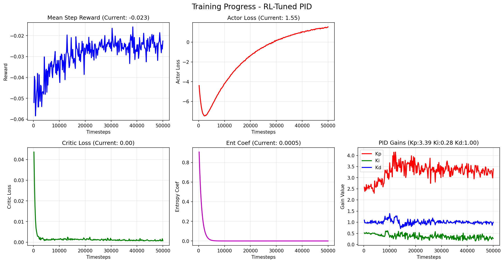
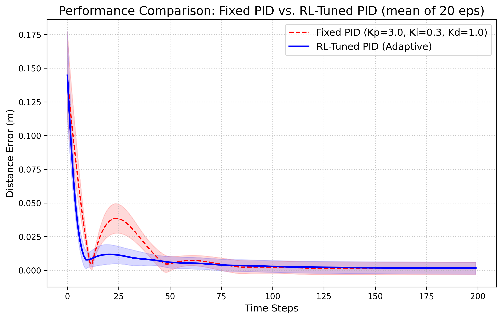

# Presentation 材料 —— 用 RL 在线整定 PID 增益（FetchReach 机械臂）

> 一句话主旨：**不要让 RL 取代 PID，而是让 RL 去"调" PID。** 在 FetchReach 到达任务上，让 SAC 实时输出 `[Kp, Ki, Kd]`、由内层 PID 闭环驱动机械臂。结果：RL 学到的**平均增益**几乎等于人工精调的固定 PID，但因为它能**沿轨迹动态调节增益**，在瞬态上把**过冲压低 3 倍、调节时间缩短 6 倍**，而稳态精度持平。

相关代码：`robot_arm/test_rl_pid.py`（训练）、`robot_arm/compare_pid_rl.py`（对比）。
图表：`robot_arm/result_data/`。复现对比命令：`cd robot_arm && python compare_pid_rl.py`。

---

## Slide 1 — 问题设定 & 为什么这样设计

- **任务：** `FetchReach-v4`（Fetch 7-DoF 机械臂，末端到达 3D 目标点），dense 奖励。全驱动、反馈友好。
- **核心想法（区别于"RL 直接输出动作"）：** 不让神经网络直接吐速度指令，而是让它在**每一步输出一组 PID 增益 `[Kp, Ki, Kd]`**，再由一个**内层 PID 控制器**根据 `误差 = 目标 − 末端位置` 算出速度去驱动机械臂。
- **为什么这样做（卖点）：**
  1. **结构可解释 / 可上线**：底层始终是工程师信得过的 PID，RL 只负责"拧旋钮"。
  2. **天然的增益调度（gain scheduling）**：固定 PID 只能用一组增益走完全程；让 RL 按状态调增益，等于自动学到"远处大增益快逼近、近处小增益抑过冲"的分段策略。
  3. **诚实的对照**：固定 PID 是个强基线，能干净地回答"自适应到底带来了什么"。

> 讲解点：这是"learning + control"的混合范式 —— **保留经典控制的结构与安全性，用学习补上自适应能力。**

---

## Slide 2 — 方法：动作重定义、内层 PID、奖励、训练

### 2.1 动作空间重定义（核心）
RL 策略输出 `a ∈ [−1, 1]³`，线性映射到真实增益范围：

```
Kp = (a₀ + 1) × 2.5   →  [0, 5]
Ki = (a₁ + 1) × 0.5   →  [0, 1]
Kd = (a₂ + 1) × 1.0   →  [0, 2]
```

### 2.2 内层 PID 闭环（每个 env step 内执行）
```
error          = desired_goal − gripper_pos        # 3D
integral      += error;  integral = clip(integral, −1, 1)   # 抗积分饱和
derivative     = error − prev_error
v              = Kp·error + Ki·integral + Kd·derivative
action[:3]     = clip(v, −1, 1)                     # 速度指令；夹爪维=0
```

### 2.3 奖励整形（鼓励"快、准、稳"）
```
reward = −dist
       − 0.1·speed²        (仅当 dist < 3cm：靠近目标时罚速度 → 抑过冲/抖动)
       + 0.02              (仅当 dist < 1.5cm：停留奖励 → 鼓励稳态)
```

### 2.4 训练配置
- 算法 **SAC**（`MultiInputPolicy`，off-policy，连续控制样本效率高），`lr=1e-3`，**50k 步**。
- 训练时加了观测噪声（`obs_sigma=0.005`、`goal_sigma=0.002`）——**见 Slide 5 的诚实声明**。

> 关键：经典 PID 不"学"，它的增益是人调死的；RL-PID 把"调增益"这件事交给学习，且**逐步**调。

---

## Slide 3 — 图 1：训练收敛 & "RL 学到了什么增益"

`robot_arm/result_data/training_curves_rl_pid_noise.png`



- **收敛信号（该看的）**：`mean step reward` 从 −0.06 升到 ≈ −0.023；`ent_coef` 从 0.9 自适应衰减到 ≈ 5e-4（探索→利用）；`critic_loss` 快速降到近 0。`actor_loss` 单调上升是 SAC 的正常现象（`E[α·logπ − Q]`，随 `Q` 学好而抬升），**不是发散**。
- **★ 最有价值的观察 ★**：右下子图——RL 收敛到的**平均增益 ≈ `Kp 3.39 / Ki 0.28 / Kd 1.00`**。
  - 这说明学习自己找到了一组**物理上合理**的增益（高 Kp 快响应、中等 Kd 提供阻尼、低 Ki 防积分过冲）。
  - 也正是据此，我们把对比用的"固定 PID 基线"设为 **`(3.0, 0.3, 1.0)`**——几乎就是 RL 的平均答案。**这让对比变得诚实**：不是拿 RL 去打一个故意调坏的 PID。

---

## Slide 4 — 图 2：固定 PID vs RL-PID（主结果）

`robot_arm/result_data/pid_vs_rl_pid_comparison.png`（20 个**匹配 seed** episode 的均值 ± 标准差，200 步）



**量化指标（20 episodes 均值；两者用完全相同的目标点）：**

| 指标 | Fixed PID (3.0/0.3/1.0) | RL-Tuned PID | 优势 |
|---|---|---|---|
| 初始误差（同 seed） | 0.145 m | 0.145 m | —（公平起点）|
| 首次进入 1.5cm | 第 10 步 | 第 8 步 | 略快 |
| **过冲峰值（回弹）** | **0.039 m** | **0.012 m** | **小 ~3×** |
| **调节时间（稳定到 2cm 内）** | **第 37 步** | **第 6 步** | **快 ~6×** |
| 稳态误差（后 50 步均值） | 0.0014 m | 0.0017 m | 基本持平 |

- **现象**：两条曲线前 ~8 步几乎重合地快速下降；之后**固定 PID 出现明显过冲**（第 25 步附近回弹到 0.039m）再衰减振荡，约第 37 步才稳；**RL 只有一个 0.012m 的小鼓包就平滑收敛**（第 6 步即进入 2cm）。75 步后两者稳态几乎重合。
- **结论**：在稳态精度相同（增益均值相同）的前提下，**RL 的优势完全体现在瞬态**——更小过冲、更快整定、方差更小。

---

## Slide 5 — 核心结论 & 诚实声明（presentation 的"灵魂"）

### 核心结论
1. **RL 学到的平均增益 ≈ 人工精调的好 PID（3.39/0.28/1.00 ≈ 3.0/0.3/1.0）。** → 学习找到的解是物理合理的，且给了我们一个**强基线**。
2. **稳态持平、瞬态完胜。** 过冲 ↓3×、调节时间 ↓6×。**差距的来源不是"更好的增益"，而是"会变的增益"**——RL 沿轨迹做了固定增益做不到的**自适应增益调度**（远处大增益冲、近处收增益稳）。
3. **范式价值**：RL 作为**在线自整定器（auto-tuner）**叠加在 PID 之上，既保留经典控制的结构/可解释/安全，又拿到自适应带来的瞬态性能。

### 诚实声明（主动暴露 + 后续工作，体现严谨）
- **观测噪声其实没进入内层 PID 回路**：当前实现里 PID 的误差用的是**真值**（`_get_obs()`），噪声只加在喂给策略选增益的观测上。所以"抗噪鲁棒性"这一项**还没被真正验证**——这是已知的待修项。
- **稳态误差 RL 略高 0.3mm**：因为优势在瞬态而非稳态；且纯学习没有显式积分消差结构。
- **基线只比了一组固定增益**：结论是"在同等增益均值下自适应更优"，而非"PID 不行"。

### 方法学（为什么这张图可信）—— 我们修掉的对比陷阱
- 同一批 **matched seed**（两控制器面对完全相同的随机目标，已验证 t=0 误差逐 episode 相等）；
- 20 episodes 取均值 ± 标准差，而非单次 rollout；
- 正确处理 episode 时限（把 `max_episode_steps` 放宽到 200，而非在已截断环境上越界 step）；
- 图例增益、加载的模型名（`sac_pid_tuner_noise`）与代码集中配置、保证一致。

> 总讲解点：**这是一个微缩的"learning-augmented control"案例 —— 用学习去自适应地整定一个可信赖的经典控制器，在不牺牲稳态与可解释性的前提下，显著改善瞬态品质。**

---

## 附录 — 一句话 Q&A 储备
- **Q：为什么不让 RL 直接输出速度？** A：那样丢了 PID 的结构与可解释性；让它调增益既安全又能复用工程经验，且学到的就是"增益调度"。
- **Q：为什么 SAC 不用 PPO？** A：连续控制下 off-policy 的 replay 复用 + 熵正则探索样本效率更高（同项目倒立摆实验里 SAC ≈ 12k 步、PPO ≈ 200k 步）。
- **Q：稳态 RL 还略差，凭什么说更好？** A：在增益均值相同的对照下，价值在瞬态（过冲/整定）；稳态差 0.3mm 属同一量级噪声，且可用加积分结构补齐。
- **Q：那块观测噪声没生效，会不会推翻结论？** A：不会——主结论是"自适应增益改善瞬态"，与噪声无关；噪声鲁棒性是**另一条**尚待验证的命题，已列为后续工作。
